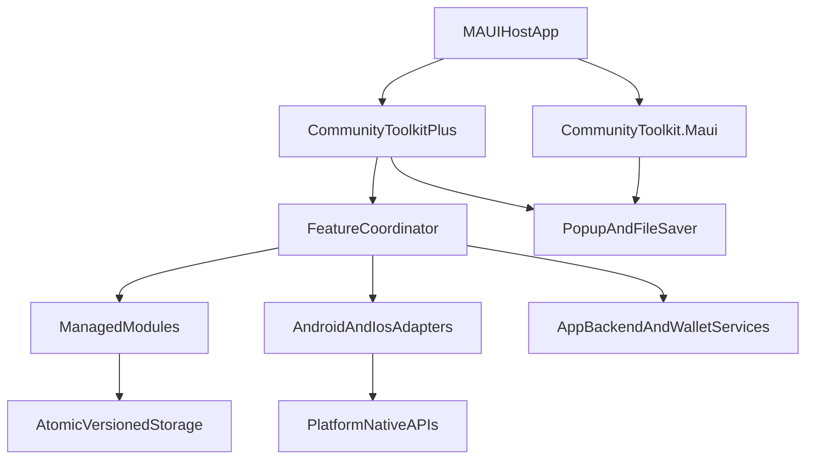

# Plugin.Maui.CommunityToolkitPlus Design Plan

## Overview

`Plugin.Maui.CommunityToolkitPlus` is an unofficial companion package for
[`CommunityToolkit.Maui`](https://github.com/CommunityToolkit/Maui). It adds opt-in,
production-focused capabilities that are not provided by the official toolkit.

The package is not affiliated with or endorsed by Microsoft, the .NET Foundation,
or the CommunityToolkit organization.

## Product decisions

- Package ID, assembly, and root namespace: `Plugin.Maui.CommunityToolkitPlus`
- Repository: `https://github.com/nuvyntralabs/Plugin.Maui.CommunityToolkitPlus`
- MauiEssentials submodule path: `CommunityToolkitPlus/`
- Initial version: `0.1.0-preview.1`
- Target frameworks:
  - `net10.0`
  - `net10.0-android` with Android API 21+
  - `net10.0-ios` with iOS 15+
- Minimum toolkit dependency: `CommunityToolkit.Maui` 15.0.1
- XAML namespace: `http://schemas.mauiessentials.dev/communitytoolkitplus`
- Recommended XAML prefix: `ctp`

This is an intentional umbrella package. All seven modules ship in one assembly,
but every module is explicitly opt-in. Disabled modules must not request
permissions, execute network calls, display UI, or register background work.

The package must not depend on sibling MauiEssentials plugins.

## CommunityToolkit.Maui integration

The NuGet package has a direct dependency on `CommunityToolkit.Maui`, so consuming
applications can continue to use all official toolkit APIs. Applications that
already reference a newer compatible toolkit version retain control of that
version through normal NuGet dependency resolution.

Initialization is explicit and ordered:

```csharp
builder
    .UseMauiApp<App>()
    .UseMauiCommunityToolkit()
    .UseMauiCommunityToolkitPlus(options =>
    {
        options.AccessibilityAudit.Enabled = true;
        options.StateRestoration.Enabled = true;
    });
```

`UseMauiCommunityToolkitPlus` must not invoke `UseMauiCommunityToolkit`
internally because the upstream initializer is not documented as idempotent.
Calling the official initializer directly also remains compatible with its
analyzers. Plus initialization should fail with a clear message when the
official toolkit has not been initialized first.

CommunityToolkitPlus can use official toolkit services internally, including
Popup for development and consent UI and FileSaver for exported reports.

## Architecture



## Repository structure

```text
Plugin.Maui.CommunityToolkitPlus/
├── .github/
│   └── FUNDING.yml
├── samples/
│   ├── CommunityToolkitPlus.Sample/
│   └── CommunityToolkitPlus.ServerSample/
├── src/
│   └── Plugin.Maui.CommunityToolkitPlus/
│       ├── Features/
│       │   ├── AccessibilityAudit/
│       │   ├── AppIntegrity/
│       │   ├── PrivacyConsent/
│       │   ├── StateRestoration/
│       │   ├── TrustedTime/
│       │   ├── UpgradeGuard/
│       │   └── WalletPasses/
│       ├── Internal/
│       ├── Platforms/
│       │   ├── Android/
│       │   └── iOS/
│       ├── Properties/
│       │   └── Xmlns.cs
│       ├── CommunityToolkitPlus.cs
│       ├── CommunityToolkitPlusOptions.cs
│       ├── ICommunityToolkitPlus.cs
│       ├── MauiAppBuilderExtensions.cs
│       └── Plugin.Maui.CommunityToolkitPlus.csproj
├── tests/
│   └── Plugin.Maui.CommunityToolkitPlus.Tests/
├── AGENTS.md
├── CHANGELOG.md
├── DESIGN.md
├── Directory.Build.props
├── LICENSE
├── README.md
├── llms.txt
├── nuget.config
└── Plugin.Maui.CommunityToolkitPlus.sln
```

Use `FormValidation` as the primary repository and package template. Use
`AppUpdate` as the reference for platform adapters, lifecycle integration,
dependency injection, and `IMauiInitializeService`.

## Shared foundation

### Registration and options

Expose:

- `UseMauiCommunityToolkitPlus(Action<CommunityToolkitPlusOptions>?)`
- `CommunityToolkitPlusOptions`
- One sealed nested options object per module
- `ICommunityToolkitPlus`
- `CommunityToolkitPlus.Default`

Register only enabled modules with `TryAddSingleton` and
`TryAddEnumerable`. Validate missing endpoints, invalid durations, and
incompatible settings during registration.

Consumers should inject individual module interfaces. The aggregate facade is
for capability discovery and convenience, not mandatory service-location.

### Persistence

Provide an internal atomic, versioned JSON store below:

```text
FileSystem.AppDataDirectory/community-toolkit-plus/
```

Requirements:

- Write to a temporary file and atomically replace the active file.
- Include schema and data version fields.
- Detect corruption and retain the last known valid snapshot when possible.
- Serialize access to each store.
- Permit custom storage and data-protection implementations.
- Never write integrity proofs, consent details, or wallet payloads to logs.

### Compatibility and quality

- Enable nullable reference types and XML documentation.
- Enable trimming and AOT analyzers.
- Avoid reflection-based registration in the first release.
- Accept `CancellationToken` on asynchronous public APIs.
- Use stable error codes and structured results for expected failures.
- Integrate with `ILogger` without requiring a custom logging abstraction.
- Use injectable `TimeProvider` and platform adapters for deterministic tests.
- The plain `net10.0` target must expose testable contracts and return explicit
  unsupported results for native operations.

## Module 1: App Integrity

### Problem

Protect sensitive backend operations from unofficial clients, modified apps,
automated abuse, and replayed requests.

### Public contracts

- `IAppIntegrityService`
- `IIntegrityChallengeProvider`
- `IntegrityChallenge`
- `IntegrityProof`
- `IntegrityCapability`
- `IntegrityOperationResult`
- Stable integrity error codes

### Behavior

- Android creates opaque Google Play Integrity proofs.
- iOS provisions and persists an App Attest key and creates attestations and
  assertions.
- Challenges include expiry and replay identifiers.
- Support key loss, regeneration, unsupported devices, cancellation, and
  transient platform failures.
- An optional delegating handler protects only explicitly selected requests.
- The client must never report a local “trusted” verdict. Only a backend can
  verify a platform proof and nonce.

### Host requirements

- Document Android cloud project, package, and signing configuration.
- Document the iOS App Attest entitlement and environments.
- Keep all verification credentials and private material on the backend.
- Include a non-packable ASP.NET sample that demonstrates the challenge/proof
  protocol without embedding production secrets.

## Module 2: Accessibility Audit

### Problem

Find common accessibility defects before release and make them visible in local
development and CI.

### Public contracts

- `IAccessibilityAuditService`
- `AccessibilityAuditReport`
- `AccessibilityFinding`
- `AccessibilityRule`
- `AccessibilitySeverity`
- JSON and SARIF exporters

### Initial rules

- Missing semantic labels
- Duplicate automation IDs
- Undersized interactive targets
- Obvious foreground/background contrast failures
- Interactive images without descriptions
- Suspicious focus ordering
- Text clipping at configured accessibility font scales

Rules that cannot be measured reliably must return `NotEvaluated` instead of a
false pass. The output assists accessibility testing and must not claim WCAG
certification.

Use CommunityToolkit Popup for the development overlay and FileSaver for report
export. Automatic scanning is DEBUG-only by default.

## Module 3: State Restoration

### Problem

Restore unfinished workflows and UI state after process death, OS eviction, or
device restart.

### Public contracts

- `IStateRestorationService`
- `IStateContributor`
- `StateCheckpoint`
- `StateRestoreContext`
- `IStateMigration`
- Optional `IStateProtector`

### Behavior

- Persist Shell routes, drafts, registered ViewModel/workflow state, selected
  tabs, filters, and scroll keys.
- Support explicit checkpoints in addition to lifecycle-triggered saves.
- Do not rely only on `Stopped`, because mobile operating systems may skip it.
- Load and validate state during startup, then apply navigation and UI state
  only after Shell is ready.
- Support schema migration, expiry, atomic recovery, and optional protection of
  sensitive values.
- Use explicit contributor registration to remain trimming and AOT safe.

This module restores transient UI and workflow state. It does not synchronize
domain records and does not replace `Plugin.Maui.OfflineSync`.

## Module 4: Upgrade Guard

### Problem

Prevent application updates from causing interrupted migrations, lost local
data, or permanent startup loops.

### Public contracts

- `IUpgradeGuard`
- `IAppMigration`
- `UpgradeContext`
- `UpgradeJournal`
- `IUpgradeBackupProvider`
- `StartupHealthTracker`
- `UpgradeDecision`

### Behavior

- Run ordered and idempotent migrations.
- Journal `Pending`, `Running`, `Completed`, and `Failed` states durably.
- Resume interrupted migrations.
- Support application-provided backup and rollback hooks.
- Never promise generic rollback for SQLite databases or external stores.
- Track startup attempts and require the host to mark startup healthy after a
  stable page renders.
- Return a safe-mode decision after a configurable failure threshold.
- Provide an explicitly awaited startup gate; do not fire-and-forget migrations
  from `IMauiInitializeService`.

`Plugin.Maui.AppUpdate` gets a new version onto the device. Upgrade Guard
protects local data and startup after that version is installed.

## Module 5: Trusted Time

### Problem

Provide tamper-aware time for tickets, attendance, trials, signed requests, and
other workflows that cannot trust the device wall clock.

### Public contracts

- `ITrustedTimeService`
- `ITimeSource`
- `TrustedTimeSnapshot`
- `TrustedTimeConfidence`
- `TrustedTimeChangedEventArgs`

### Behavior

- Prefer authenticated HTTPS JSON endpoints or HTTP `Date` sources.
- Support multiple sources and reject configured outliers.
- Do not use unauthenticated NTP as the default.
- Compute current trusted time from a synchronized UTC anchor plus monotonic
  elapsed time.
- Detect device wall-clock jumps.
- Persist bounded offsets and degrade confidence while offline.
- Require consumers to request trusted time explicitly; do not replace
  `DateTime.UtcNow` globally.

## Module 6: Wallet Passes

### Problem

Provide one MAUI-facing workflow for tickets, loyalty cards, memberships,
coupons, and similar Apple Wallet or Google Wallet passes.

### Public contracts

- `IWalletPassService`
- `IWalletPassPayloadProvider`
- `WalletCapability`
- `WalletPassPayload`
- `WalletOperationResult`

### Behavior

- iOS validates and presents `.pkpass` or `.pkpasses` through PassKit.
- Android opens a backend-issued Google Wallet save URL or JWT.
- Report platform capability differences instead of promising identical
  list/update/remove behavior.
- Keep certificates, signing keys, Google service accounts, pass signing, and
  Google Wallet object creation on the backend.
- Include sample flows for a ticket, loyalty card, and coupon.

## Module 7: Privacy Consent

### Problem

Coordinate purpose-based legal consent and prevent SDK initialization before
the required consent decision exists.

### Public contracts

- `IPrivacyConsentService`
- `PrivacyPurpose`
- `ConsentPolicy`
- `ConsentReceipt`
- `ConsentDecision`
- `IConsentRegionProvider`
- `IConsentPlatformAdapter`
- SDK activation gates

### Behavior

- Maintain an immutable, versioned local consent ledger.
- Support acceptance, denial, revocation, expiry, and policy renewal.
- Gate registered SDK initializers by purpose.
- Provide a CommunityToolkit Popup-based default presenter.
- Provide an iOS ATT adapter when the host supplies
  `NSUserTrackingUsageDescription`.
- Define adapter contracts for Google UMP and other consent-management
  platforms without forcing advertising SDK dependencies on all consumers.
- Do not infer legal region from IP by default.
- State clearly that the package helps implement consent flows but does not
  guarantee GDPR, CCPA, or other legal compliance.

This module is separate from OS permission orchestration. Legal consent and
camera/location permissions are different decisions.

## Sample application

Create `samples/CommunityToolkitPlus.Sample` with one Shell page per module.

The sample must:

- Target Android and iOS.
- Use fake integrity and wallet backend providers by default.
- Display supported and unsupported capabilities.
- Include exact AndroidManifest, Info.plist, entitlement, and privacy-manifest
  examples.
- Demonstrate ordered toolkit and Plus initialization.
- Contain no production credentials or private keys.
- Include documented manual real-device scenarios where simulators cannot
  exercise the native API.

## Test strategy

Create `tests/Plugin.Maui.CommunityToolkitPlus.Tests` on `net10.0` using the
xUnit versions adopted by the other MauiEssentials plugins.

Cover:

- Builder registration order and option validation
- Disabled modules producing no side effects
- CommunityToolkit dependency coexistence
- Atomic persistence, corruption, and recovery
- State migrations and expired checkpoints
- Interrupted upgrade journals and startup-loop detection
- Trusted-time wall-clock jumps, staleness, and outlier rejection
- Consent policy renewal and revocation
- Wallet capability mapping
- Accessibility rule evaluation and SARIF generation
- Integrity challenge expiry and key-state transitions with fakes

Add Android and iOS compile checks. Before stable release, manually verify Play
Integrity, App Attest, PassKit, Google Wallet handoff, ATT, process-death
restoration, and foreground/background lifecycle behavior on real devices.

## Package and release workflow

Use the existing MauiEssentials manual workflow:

```bash
dotnet build src/Plugin.Maui.CommunityToolkitPlus/Plugin.Maui.CommunityToolkitPlus.csproj
dotnet test tests/Plugin.Maui.CommunityToolkitPlus.Tests/Plugin.Maui.CommunityToolkitPlus.Tests.csproj
dotnet build samples/CommunityToolkitPlus.Sample/CommunityToolkitPlus.Sample.csproj -f net10.0-android
dotnet build samples/CommunityToolkitPlus.Sample/CommunityToolkitPlus.Sample.csproj -f net10.0-ios
dotnet pack src/Plugin.Maui.CommunityToolkitPlus/Plugin.Maui.CommunityToolkitPlus.csproj -c Release -o artifacts
```

Inspect the `.nupkg` before publishing:

- Correct dependency groups and minimum CommunityToolkit.Maui version
- README, LICENSE, and icon included
- Repository and project URLs correct
- Symbols package generated
- No credentials, tokens, private keys, or machine-specific files
- No trim or AOT warnings introduced by CommunityToolkitPlus

Publish preview `.nupkg` and `.snupkg` artifacts manually, create the matching
Git tag and changelog entry, and then advance the MauiEssentials submodule
pointer. Automated publishing and API-compatibility baselines can be designed
separately after the first preview.

## MauiEssentials hub integration

Register the repository as:

```ini
[submodule "CommunityToolkitPlus"]
    path = CommunityToolkitPlus
    url = https://github.com/nuvyntralabs/Plugin.Maui.CommunityToolkitPlus.git
```

Update these hub files manually:

- `.gitmodules`
- `README.md`
- `docs/packages/README.md`
- `docs/getting-started.md`
- `docs/architecture.md`
- `llms.txt`
- `llms-full.txt`
- `AGENTS.md`

Use:

- NuGet: `https://www.nuget.org/packages/Plugin.Maui.CommunityToolkitPlus`
- Documentation:
  `https://nuvyntralabs.github.io/packages/plugin-maui-community-toolkit-plus/`
- White paper:
  `https://niladripadhy.vercel.app/opensource/plugin-maui-community-toolkit-plus`

Describe the package as “opt-in production extensions built on
CommunityToolkit.Maui.” Record that it is the second intentional umbrella
package after Observability, while CommunityToolkitPlus has no sibling-plugin
dependencies.

## Delivery phases

1. Scaffold the independent repository and NuGet project.
2. Implement toolkit registration, options, capabilities, logging, and storage.
3. Implement Accessibility Audit, State Restoration, Upgrade Guard, Trusted
   Time, and the Privacy Consent ledger.
4. Implement Android and iOS adapters for App Integrity, Wallet Passes, ATT,
   and accessibility inspection.
5. Complete the sample, backend contracts, documentation, and agent guidance.
6. Run unit, multi-TFM, trimming, package, process-death, and real-device tests.
7. Publish `0.1.0-preview.1`.
8. Complete all MauiEssentials hub documentation and advance the submodule
   pointer.

## Stable-release acceptance criteria

- CommunityToolkit.Maui APIs remain available transitively.
- A host with an explicit compatible toolkit version restores without conflict.
- The official toolkit initializer runs exactly once.
- Disabled modules add no permissions or runtime side effects.
- Unsupported platform behavior is explicit and predictable.
- No secrets appear in logs, packages, samples, or diagnostics.
- No new trim or AOT warnings originate from CommunityToolkitPlus.
- Security-sensitive verdicts are verified by a backend, not trusted locally.
- Android and iOS real-device evidence exists for security, wallet, consent,
  state-restoration, and lifecycle paths.
